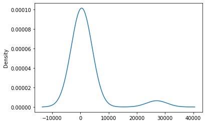
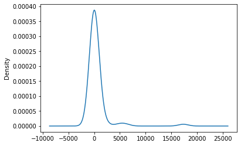
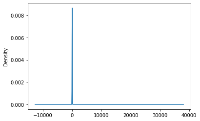

# Alphabet_Soup_Charity

Using deep-learning Neural Networks to determine which charities are likely to be a success donation.

## Project Overview
Extracted, transformed, and loaded charity_data.csv onto the Jupyter Notebook environment. The data was then trained and tested to create a prediction using neural networks to predict which charities are successful or not. The accuracy was measured to see how succesful the prediction was.

## Resources
- Data Sources: charity_data.csv
- Software: Python 3.8.0, Jupyter Notebook 6.0.1, TensorFlow 2.0.0, Pandas 1.0.1, Scikit-learn 0.22

## Summary
There were a lot of messy data in the charity_data.csv file. Each data value had to be classified as either the target, features, or trash.
The target variable for the model was the 'IS_SUCCESSFUL' column.
The features were 'APPLICATION_TYPE', 'CLASSIFICATION', 'USE_CASE', 'ORGANIZATION', 'STATUS', 'INCOME_AMT', 'SPECIAL_CONSIDERATIONS', and 'ASK_AMT'.
The variables that were removed were 'EIN' and 'NAME' because these values had too many unique values and were not import to the analysis.

- Looking at the APPLICATION_TYPE graph, there is a higher density of values with the unique count from 0 to 10000. The graph can help visualize which values need to be joined to make the a less congested encoded dataframe.

- CLASSIFICATION graph displays much more significant spike in unique values between 0 to 2500. This means that those values can really congest an encoded dataset which means that the columns should be grouped into one column.

- The ASK_AMT graph shows that most of the unique values fall under 10 per column and that there is a skewed data at over 25000 unique values in one column. This data set was organized using bins to help separate the different unique columns.

Several of the rare data in the categorical columns were bucketed so the encoding would not be too overwhelmed. 
All the categorical variables were then encoded using the one-hot encoder.
And the numberical variables were standardize using Scikit-Learn's StandardScaler.

## Analysis
Used three different types of models to compare accuracy.
Logistic Regression Model Accuracy: 0.716
SVM Model Accuracy: 0.703
Random Forest Predictive Accuracy: 0.717

The trained scaled model for the neural network came out with an accuracy of 0.7386 and a loss of 0.5400.
While the test scaled model gave an accuracy of 0.7194 with a loss of 0.5678.

The deep learning model with 2 hidden layers for the trained scaled model gave an accuracy of 0.7477 and a loss of 0.5229
The test scaled model gave an accuracy of 0.7206 and a loss of 0.5974.

The deep learning model with 4 hidden layers for the trained scaled model gave an accuracy of 0.7490 and a loss of 0.5193
The test scaled model gave an accuracy of 0.7188 and a loss of 0.6378.

Looking at all the different models, the deep learning model has a better accuracy score compared to the other models. But comparing between the whether 2 hidden layers or 4 hidden layers are better, the accuracy is better when there are only 2 hidden layers. It seems like the optimal amount of hidden layers is 2. Also having less units plays a role in the accuracy. A reason for this might be that the model is overfitting the data. But out of all the models the best choice is the deep learning neural net model.